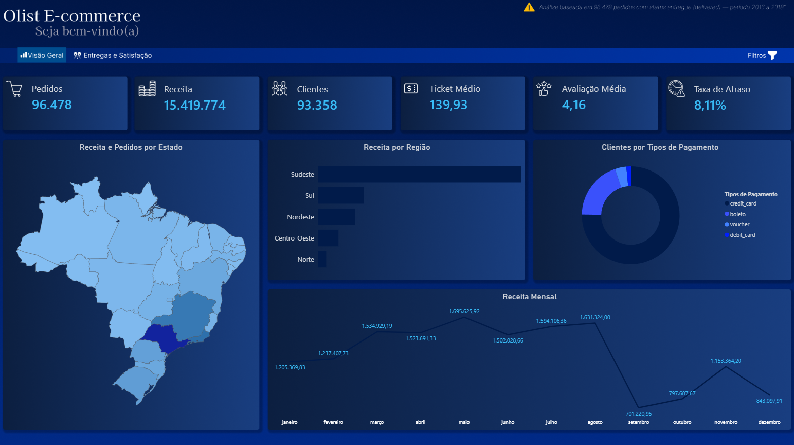
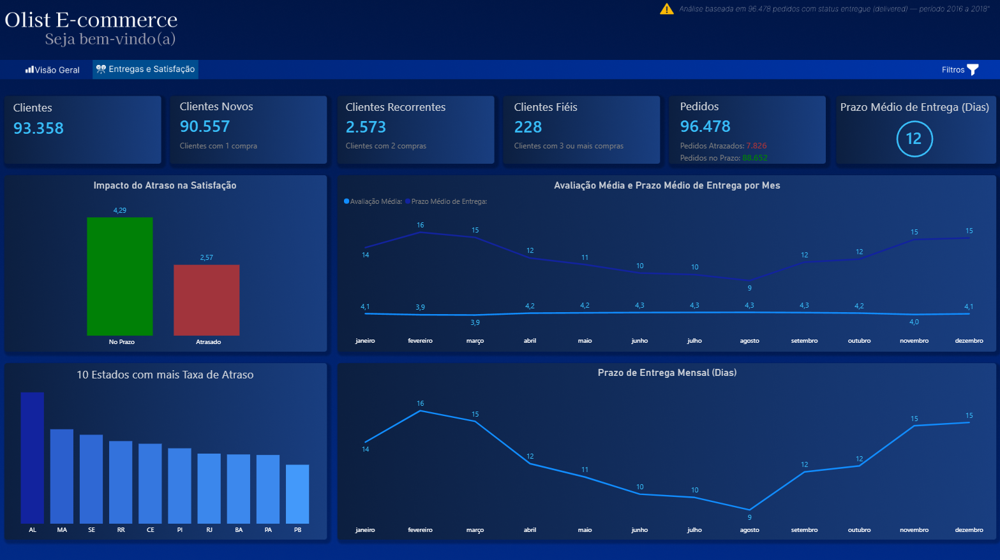

# 📊 Análise de E-commerce Brasileiro — Olist

## 📌 Sobre o Projeto
Análise completa de dados reais de e-commerce brasileiro 
utilizando SQL e Power BI, cobrindo mais de 100 mil pedidos 
do período de 2016 a 2018.

## 🛠️ Tecnologias Utilizadas
- PostgreSQL 
- pgAdmin 4
- VS Code
- Power BI Desktop

## 📂 Dataset
- Fonte: [Olist Brazilian E-Commerce - Kaggle](https://www.kaggle.com/datasets/olistbr/brazilian-ecommerce?resource=download)
- 9 arquivos CSV
- +1,5 milhão de registros

## 🗄️ Modelagem de Dados
Star Schema com 5 tabelas dimensão e 4 tabelas fato:
- dim_clientes
- dim_produtos
- dim_categorias
- dim_vendedores
- dim_geolocalizacao
- fato_pedidos
- fato_itens_pedido
- fato_pagamentos
- fato_avaliacoes

## 📊 Análises Realizadas

-- Dataset com dados de clientes e vendedores alterados(nomes) pela Olist, então não foram feitas análises diretas para esses segmentos

### Vendas
- Receita total: R$ 15,4M
- Ticket médio: R$ 139,93
- Pico de vendas: Novembro/2017 (Black Friday)

### Clientes
- 96.096 clientes únicos
- 87% compraram apenas uma vez
- Segmentação RFM: VIP, Recorrente, Alto Valor, Único

### Entregas
- Prazo médio: 12,6 dias
- Taxa de atraso: 8,11%
- AL é o estado com maior taxa de atraso (23,93%)

### Satisfação
- Média geral: 4,07 ⭐
- Pedidos no prazo: 4,29 ⭐
- Pedidos atrasados: 2,57 ⭐ (queda de 40%)

## 💡 Principais Insights
1. A Black Friday de nov/2017 gerou o maior pico de receita
2. SP concentra 42% de todos os pedidos do Brasil
3. Atraso na entrega reduz a avaliação em 40%
4. 87% dos clientes nunca voltaram a comprar — problema grave de retenção
5. 9,76% dos clientes são Alto Valor — público prioritário para reativação

## ⚠️ Desafios e Qualidade dos Dados
- dataset_review tinha review_id duplicado — removida a PRIMARY KEY
- dim_produtos tinha categorias sem tradução — tratado com COALESCE
- customer_unique_id vs customer_id — mesmo cliente com múltiplos IDs

## 🖼️ Dashboard

